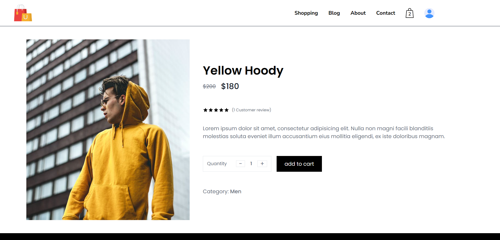
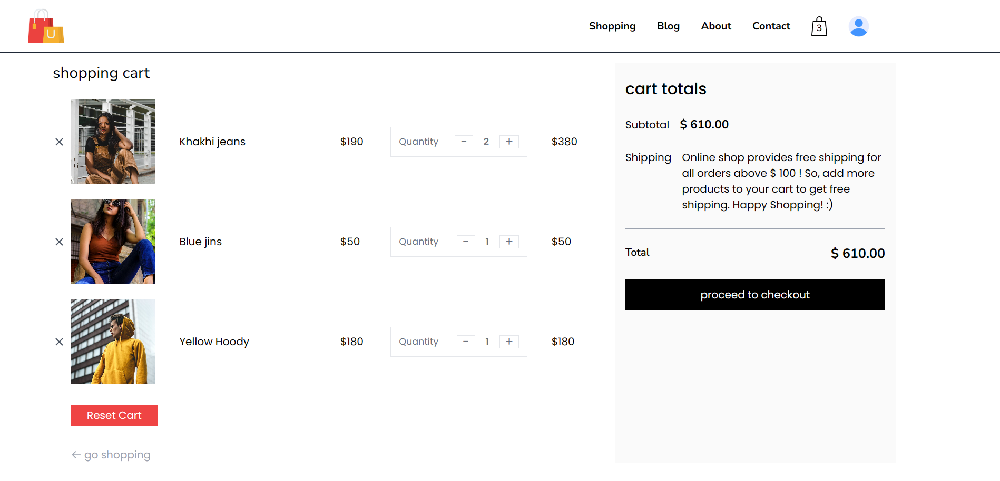

# E-Commerce Website (Online Shopping)

## Table of Contents

- [Description](#description)
- [Features](#features)
- [Technologies Used](#technologies-used)
- [Getting Started](#getting-started)
- [Installation](#installation)
- [Demo](#demo)
- [License](#license)

## Description

[go to Table of Contents](#table-of-contents)

This is an e-commerce website built using ReactJS and Tailwind CSS. It utilizes Redux for state management, Firebase as the database, and Google OAuth for user authentication. The website provides CRUD functionalities for managing products, allowing users to add, view, edit, and delete products in their inventory.

## Features

[go to Table of Contents](#table-of-contents)
- User authentication through Google OAuth.
- Add products to the cart.
- View and manage the shopping cart.
- Update the shopping cart.
- Delete product in the shopping cart.
- Responsive design using Tailwind CSS.
- Real-time updates using Firebase database.

## Technologies Used

[go to Table of Contents](#table-of-contents)
- ReactJS
- Tailwind CSS
- Redux (for state management)
- Firebase (as the database)
- Google OAuth (for user authentication)

## Getting Started

[go to Table of Contents](#table-of-contents)
Follow these instructions to get the project up and running on your local machine.

## Installation

[go to Table of Contents](#table-of-contents)
1. Clone the repository: `git clone https://github.com/yourusername/ecommerce-website.git`
2. in root folder run `npm install`
3. go to each folder client and server and install npm `cd client/` and then `npm install` | `cd server/` and then `npm install`
4. change firebase config using your firebase
5. go back to root folder and run `npm run dev` to running client and server in the same time.

## Demo

[go to Table of Contents](#table-of-contents)
You can check out a live demo of the website [here](https://your-demo-link.com).

## License

[go to Table of Contents](#table-of-contents)
This project is licensed under the [MIT License](LICENSE).
